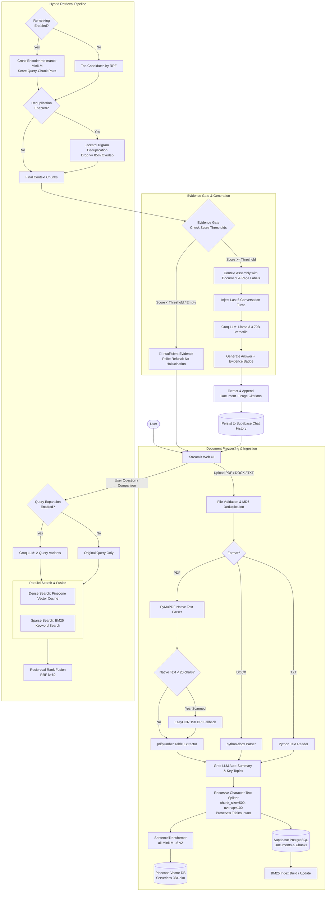

# 🧠 Smart Multi-Document RAG Assistant

A multi-document **Retrieval-Augmented Generation (RAG)** assistant built with Python and Streamlit. The system ingests PDF, DOCX, and TXT documents, extracts structured text and tables, performs OCR on scanned pages when necessary, and provides a hybrid retrieval engine (Dense Vector + Sparse BM25 + Reciprocal Rank Fusion + Cross-Encoder Re-Ranking).

It is designed to answer questions strictly from uploaded documents, provide transparent source attribution, support structured multi-document comparisons, and politely decline to answer when evidence is insufficient.

---

## 1. 🎯 Problem Understanding

Enterprise and research workflows often require querying information scattered across unstructured documents (handbooks, financial reports, technical policies, and scanned memos). Standard Large Language Models (LLMs) suffer from:
1. **Hallucinations**: Inventing facts when information is missing from their training data or context.
2. **Lack of Source Transparency**: Generating answers without verifiable citations to page numbers and passages.
3. **Retrieval Blind Spots**: Pure vector search often misses exact alphanumeric identifiers (e.g., policy numbers, product codes), while pure keyword search fails at semantic concepts.
4. **Multi-Document Complexity**: Comparing specific topics across multiple documents requires targeted multi-document scoping and structured synthesis.

This application addresses these challenges by implementing a grounded hybrid RAG pipeline with strict context grounding, heuristic evidence gating, and verifiable page-level source citations.

---

## 2. ✨ Features

- **Multi-Format Document Ingestion**:
  - Native text extraction for PDFs via PyMuPDF (`fitz`).
  - Automatic OCR fallback via EasyOCR for scanned PDF pages (< 20 characters of native text).
  - Table detection and extraction via `pdfplumber`, formatted as clean Markdown tables.
  - DOCX parsing via `python-docx` (paragraphs and tables).
  - Plain text (`.txt`) file processing.
  - Duplicate upload prevention via MD5 content hashing.
- **Advanced Hybrid Retrieval Pipeline**:
  - **Dense Vector Search**: 384-dimensional embeddings via `sentence-transformers/all-MiniLM-L6-v2` stored in Pinecone Serverless.
  - **Sparse Keyword Search**: BM25 (`BM25Okapi`) over all chunk texts with tokenization and punctuation stripping.
  - **Reciprocal Rank Fusion (RRF)**: Combines dense and sparse ranked lists using $RRF(d) = \sum \frac{1}{k + r(d)}$ ($k=60$).
  - **Cross-Encoder Re-Ranking**: `cross-encoder/ms-marco-MiniLM-L-6-v2` scores query-chunk pairs directly to re-order top candidates.
  - **Query Expansion**: Groq-powered query rephrasing generating 2 alternate queries with multi-list RRF fusion.
  - **Near-Duplicate Chunk Filtering**: Jaccard character-trigram overlap filter (default 85% threshold) to minimize context redundancy.
- **Evidence Gating & Hallucination Mitigation**:
  - Heuristic evidence indicator based on retrieval/reranking scores:
    - 🟢 **Strong Evidence**
    - 🟡 **Moderate Evidence**
    - 🔴 **Insufficient Evidence**
  - Unknown question refusal: Polite refusal when retrieved context is inadequate or irrelevant.
- **Transparent Source Attribution & Preview**:
  - Every answer includes document name and page number references.
  - Interactive source chunk inspector with similarity/cross-encoder scores.
  - In-app **Source Preview** tab reconstructing the full page text with retrieved passages highlighted in yellow.
- **Document Interaction & Comparison**:
  - **"Ask This Document"**: One-click scoping to direct queries to a single document.
  - **Document Comparison Mode**: Select 2 or more documents to generate comparative tables grounded strictly in retrieved chunks.
  - **Dynamic Query Suggestions**: Document-specific starter chips based on AI-generated summaries and key topics.
- **Multi-Turn Conversation Memory**:
  - Injects recent conversation history (last 6 turns / 3 exchanges) into the prompt context for coherent multi-turn dialogue.
- **Cloud Persistence**:
  - Documents, chunk metadata, and chat history persisted in Supabase PostgreSQL.

---

## 3. 🏗️ Architecture & Data Flow



---

## 4. 💡 Technology Choices and WHY

| Component | Technology | Rationale & Tradeoffs |
|---|---|---|
| **UI Framework** | **Streamlit** | Fast interactive prototyping, built-in chat components, quick reactive session state management for multi-turn chat and preview highlights. |
| **LLM Inference** | **Groq (Llama 3.3 70B Versatile)** | Extremely low latency inference (typically >200 tokens/sec) enabling responsive multi-query expansion, summarization, and RAG synthesis on a high-capability 70B open model. |
| **Dense Vector DB** | **Pinecone (Serverless)** | Managed serverless vector index with low-latency cosine similarity, native metadata filtering (`$eq`, `$in`), and zero maintenance overhead. |
| **Relational Database** | **Supabase (PostgreSQL)** | Robust cloud PostgreSQL database to store structured document metadata, chunk text, full page text for highlighting, and chat conversation history. |
| **Embedding Model** | **`all-MiniLM-L6-v2`** | Lightweight (80MB), fast CPU inference, 384-dimensional dense vectors with strong performance on retrieval benchmarks. |
| **Sparse Keyword Search** | **`rank-bm25` (BM25Okapi)** | Complements dense retrieval by accurately matching exact keywords, alphanumeric codes, acronyms, and product IDs that dense embeddings may overlook. |
| **Re-Ranker** | **`cross-encoder/ms-marco-MiniLM-L-6-v2`** | Jointly evaluates `(query, chunk)` cross-attention to resolve semantic nuance and keyword stuffing, significantly outperforming bi-encoder cosine ranking. |
| **PDF Parsing** | **PyMuPDF (`fitz`) + `pdfplumber`** | PyMuPDF provides fast native text extraction; `pdfplumber` performs accurate tabular structure extraction to preserve table schemas in Markdown. |
| **OCR Fallback** | **EasyOCR** | Pure Python/PyTorch OCR solution that automatically activates when scanned or image-only PDF pages are detected (< 20 native text characters). |
| **DOCX Parsing** | **`python-docx`** | Reliable extraction of structured paragraphs and row-major tabular data from Microsoft Word documents. |

---

## 5. 🔄 Detailed RAG Pipeline

1. **Document Validation & Ingestion**:
   - Files are validated against an extension allowlist (`.pdf`, `.docx`, `.txt`) and a 50MB file size limit.
   - An MD5 hash of the raw file content is computed. If the hash matches an existing document in Supabase, the upload is skipped to prevent duplicate vector indexing.
2. **Text & Table Extraction**:
   - For PDFs, PyMuPDF extracts native text per page. If a page yields fewer than 20 characters, EasyOCR renders the page at 150 DPI and extracts text via optical character recognition.
   - `pdfplumber` extracts tables and converts them to formatted Markdown tables tagged as `table` chunks.
   - For DOCX, paragraphs and tables are extracted in document order.
3. **Chunking**:
   - Text is split using a recursive character text splitter with `chunk_size = 500` characters and `overlap = 100` characters.
   - Table chunks are preserved intact to prevent breaking rows across chunks.
   - Chunks receive deterministic IDs: `{doc_name}#page_{N}#text_chunk_{i}`.
4. **Vector Embedding & Indexing**:
   - `sentence-transformers/all-MiniLM-L6-v2` encodes text chunks in batches of 32 into 384-dimensional vectors.
   - Vectors are upserted to Pinecone with metadata (`document_name`, `document_id`, `page_number`, `chunk_type`, `chunk_text`).
   - Document metadata and raw chunks are saved in Supabase PostgreSQL.
   - The BM25 index is updated in-memory.

---

## 6. 🔀 Hybrid Retrieval

Pure dense retrieval can fail when queries involve exact numbers, acronyms, or rare terms. Pure sparse retrieval (BM25) fails when queries use synonyms or natural language paraphrases.

This assistant implements **Hybrid Retrieval**:
1. When a user asks a question, the query is embedded and sent to Pinecone for dense cosine similarity search (fetching top candidates).
2. Concurrently, the tokenized query is scored against the BM25 index over all Supabase chunks.
3. If document filtering is active, metadata filters (`$in` / `$eq`) are applied simultaneously to both Pinecone and BM25.
4. The ranked result sets are fused using **Reciprocal Rank Fusion (RRF)**.

---

## 7. 📖 BM25 Implementation

- Implemented using `rank_bm25.BM25Okapi`.
- Index is constructed from all chunks currently stored in Supabase.
- Tokenization converts text to lowercase, removes punctuation, and splits on whitespace.
- Supports scoped filtering: if specific documents are selected in the UI, BM25 filters candidates before ranking.

---

## 8. 🧮 Reciprocal Rank Fusion (RRF)

Reciprocal Rank Fusion merges multiple ranked lists without requiring score normalization:

$$RRF\_Score(d) = \sum_{m \in M} \frac{1}{k + r_m(d)}$$

- $M$: The set of retrieval passes (e.g., Dense pass, BM25 pass, or expanded query passes).
- $r_m(d)$: The 1-based rank of document chunk $d$ in retrieval list $m$.
- $k$: Smoothing constant, set to $60$ (standard industry baseline).

RRF guarantees that documents appearing near the top of both dense and sparse lists receive the highest combined priority.

---

## 9. 🎯 Cross-Encoder Re-Ranking

- **Model**: `cross-encoder/ms-marco-MiniLM-L-6-v2`.
- **Process**:
  - The hybrid RRF step retrieves an expanded candidate pool (top 20 chunks).
  - The cross-encoder takes `(query, chunk_text)` pairs and computes a joint cross-attention relevance score for each pair.
  - Candidates are re-sorted by cross-encoder score in descending order, and the top 5 highest-scoring chunks are retained for context assembly.
- Can be toggled on/off in the sidebar.

---

## 10. ⚡ Query Expansion

- When enabled via the sidebar toggle, the user's query is sent to Groq (`llama-3.3-70b-versatile`) with instructions to produce 2 alternative search phrasings in JSON format.
- The system executes dense and sparse searches for all 3 queries (original + 2 variants).
- All 6 resulting lists are fused via multi-list Reciprocal Rank Fusion, capturing different vocabulary formulations of the same intent.
- If the LLM call fails or times out, the system cleanly falls back to the original query.

---

## 11. 🛡️ Hallucination Mitigation

Hallucinations are prevented through a multi-tier defense:
1. **Strict Grounding System Prompt**:
   - The LLM is explicitly instructed to answer **ONLY** using the provided context blocks.
   - If the context does not contain sufficient facts to answer the question, the model is instructed to state that the information is unavailable.
2. **Context Block Demarcation**:
   - Context is injected into the LLM prompt with explicit labels:
     `[Context Block N | document_name.pdf, Page X (Score: Y.YY)]`
3. **Temperature Tuning**:
   - `temperature = 0.4` is used to balance conversational fluidity with deterministic adherence to context.
4. **Near-Duplicate Chunk Filtering**:
   - Jaccard trigram overlap filtering drops redundant chunks, preventing repeated text from crowding out diverse evidence.

---

## 12. 🚪 Evidence Gate

To provide transparency into answer groundedness, the system computes a heuristic evidence level based on the retrieval and reranker scores of the top chunks:

| Evidence Level | Badge | Condition |
|---|---|---|
| **Strong** | 🟢 Evidence: Strong | Cross-encoder score $\ge 0.5$ or top cosine similarity $\ge 0.70$ |
| **Moderate** | 🟡 Evidence: Moderate | Cross-encoder score $\ge 0.0$ or top cosine similarity $\ge 0.45$ |
| **Insufficient** | 🔴 Insufficient Evidence | Top score below threshold or empty candidate set |

> **Note on Calibration**: The evidence indicator is a **heuristic scoring threshold**, not a mathematically calibrated Bayesian probability distribution. It provides an operational signal of retrieval confidence.

---

## 13. ❓ Unknown Question Handling

When a user asks a question about information not present in the uploaded documents, the retrieval scores fall below the minimum evidence threshold, triggering the **Unknown Question Refusal**:

### Example Walkthrough:

**User Question:**
> *"What is the company's current stock price?"*

**System Response:**
> 🔴 **Insufficient Evidence**
> 
> *I couldn't find enough relevant information in the uploaded documents to answer this reliably. Could you clarify, or would you like me to look for something related in your uploaded files?*

The system avoids hallucinating market data, company financials, or speculative facts when no supporting text exists in the indexed documents.

---

## 14. 📎 Source Attribution & Highlighting

Every generated answer that passes the evidence gate includes clear citations:

```text
Employees receive 24 days of annual leave per calendar year.

🟢 Evidence: Strong

Sources:
📄 employee_handbook.pdf — Page 4
📄 leave_policy.pdf — Page 2
```

### In-App Source Preview:
- In the **Inspector Panel** → **Source Preview** tab, users can select any cited document and page.
- The app reconstructs the page text and highlights the exact retrieved chunk in yellow (`<mark style="background-color: #fef08a">`).

---

## 15. 🧠 Conversation Memory

- The chat interface maintains multi-turn conversation context.
- The last **6 turns** (3 user questions and 3 assistant answers) are formatted and prepended to the LLM prompt.
- This allows follow-up questions such as *"Can you explain the second point in more detail?"* without repeating previous context.
- Users can reset memory at any time using the **Clear Chat History** button in the sidebar.

---

## 16. 📊 Document Comparison

The assistant supports comparative analysis across multiple documents:

1. **Selection**: Users select two or more documents via the multi-select filter in the chat header.
2. **Comparison Query**: Users ask a comparative question (e.g., *"Compare the annual leave and probation policies between these documents"*).
3. **Retrieval**: Hybrid retrieval gathers relevant chunks scoped to all selected documents.
4. **Structured Output**: The LLM synthesizes the findings into a structured comparison table:

| Topic | Employee Handbook.pdf | Contractor Agreement.pdf |
|---|---|---|
| **Annual Leave** | 24 days paid leave (Page 4) | Not eligible for paid leave (Page 2) |
| **Probation Period** | 3 months with review (Page 1) | No probation period (Page 1) |
| **Notice Period** | 30 days written notice (Page 8) | 14 days written notice (Page 3) |

Every cell in the comparison is grounded in retrieved chunks, and the evidence gate prevents fabricating missing comparison dimensions.

---

## 17. ⚙️ Setup & Installation

### Prerequisites
- Python 3.10 to 3.12
- Git

### 1. Clone the Repository
```bash
git clone https://github.com/hemanthd4641/SMART-PDF-RAG-ASSISTANT.git
cd SMART-PDF-RAG-ASSISTANT
```

### 2. Create and Activate Virtual Environment
```bash
# Windows (PowerShell):
python -m venv venv
.\venv\Scripts\Activate.ps1

# macOS / Linux:
python3 -m venv venv
source venv/bin/activate
```

### 3. Install Dependencies
```bash
pip install -r requirements.txt
```

---

## 18. 🔑 Environment Variables

Create a `.env` file in the project root (or copy `.env.example`):

```bash
cp .env.example .env
```

Configure the following variables:

```env
# Groq LLM API Key (https://console.groq.com)
GROQ_API_KEY=gsk_your_groq_api_key
GROQ_MODEL=llama-3.3-70b-versatile

# Pinecone Vector DB (https://app.pinecone.io)
PINECONE_API_KEY=pcsk_your_pinecone_api_key
PINECONE_INDEX_NAME=rag-assistant-index

# Supabase Cloud Database (https://supabase.com)
SUPABASE_URL=https://your-project-id.supabase.co
SUPABASE_KEY=your_supabase_anon_public_key

# Embedding & Runtime Configuration
EMBEDDING_MODEL_NAME=all-MiniLM-L6-v2
PORT=8501
DEBUG=True
```

### Database Schema Setup (Supabase)
Run the SQL script located in `database/schema.sql` in your Supabase SQL Editor to create the `documents`, `chunks`, and `chat_history` tables.

---

## 19. 🚀 Running the Application

Start the Streamlit application:

```bash
streamlit run app.py
```

Open your browser at `http://localhost:8501`.

> **Demo Mode**: If API keys are not provided, the application will launch in a safe Demo Mode with sample responses, allowing you to preview the UI layout without crashing.

---

## 20. 🧪 Testing & Verification

The project includes test scripts in `scratch/` to verify each component independently:

```bash
# Run reliability and error-handling test suite (30 assertions)
python scratch/test_reliability.py

# Verify document parsers (PDF, DOCX, TXT)
python scratch/test_parser.py
python scratch/test_docx.py

# Verify text chunker & table preservation
python scratch/test_chunker.py

# Verify hybrid retrieval & RRF
python scratch/test_hybrid.py

# Verify cross-encoder re-ranking
python scratch/test_reranker.py

# Verify Groq LLM integration & citations
python scratch/test_llm.py
python scratch/test_citations.py
```

---

## 21. ⚠️ Known Limitations

1. **OCR Performance & Latency**: EasyOCR runs on CPU by default. Processing complex or multi-page scanned PDFs can take several seconds per page.
2. **In-Memory BM25 Index**: The BM25 index is built and held in application memory from Supabase chunks. For datasets exceeding hundreds of thousands of chunks, an external full-text search index (such as PostgreSQL `tsvector` or Elasticsearch) would be required.
3. **Re-Ranking Latency**: The Cross-Encoder model runs on CPU, adding ~200–500ms of latency per query when scoring top-20 candidates.
4. **Heuristic Evidence Score**: The evidence gate relies on similarity and cross-encoder score thresholds rather than a formal statistical calibration method.
5. **No Native Image/Chart Reasoning**: The system extracts text and table structures but does not currently perform multimodal visual reasoning over embedded charts or complex diagrams.

---

## 22. 🤖 AI Tools Used

In compliance with assessment transparency guidelines, the following AI tools assisted development:

- **Claude / Gemini / ChatGPT**:
  - Architecture design for the multi-stage hybrid RRF pipeline and cross-encoder re-ranking.
  - Drafting unit test assertions in `scratch/` for parser edge cases, chunk boundary testing, and schema migrations.
  - Prompt engineering for strict context grounding and JSON-mode document summary extraction.
- **GitHub Copilot / Antigravity IDE**:
  - Code completion for Streamlit layout components, PyMuPDF extraction routines, and Supabase client calls.

---

## 23. ⏱️ Development Time Log

| Phase | Time Spent | Tasks Completed |
|---|---|---|
| **Architecture & Pipeline Design** | 0.5 Hours | Requirements analysis, RAG architecture formulation, RRF fusion formulas, technology stack selection. |
| **Document Processing & Ingestion** | 2.0 Hours | PyMuPDF text parser, EasyOCR fallback, `pdfplumber` table extraction, `python-docx` parser, chunker with table preservation. |
| **Vector Indexing & Hybrid Retrieval** | 2.0 Hours | Pinecone serverless integration, BM25 indexing, Reciprocal Rank Fusion, Cross-Encoder re-ranking, query expansion. |
| **Generation, Evidence Gate & Comparison** | 1.5 Hours | Groq Llama 3.3 integration, heuristic evidence gate, source citation formatter, yellow passage preview, multi-document comparison mode. |
| **Reliability, Security & Testing** | 1.0 Hours | Error handling pass, environment variable validation, 30 automated reliability tests in `scratch/test_reliability.py`. |
| **Documentation & Walkthrough** | 1.0 Hours | Comprehensive README.md authoring, Mermaid data flow diagrams, setup documentation. |
| **Total** | **8.0 Hours** | Complete implementation, testing, and submission-ready documentation. |

---

## 24. 🔮 Future Improvements

1. **PostgreSQL pgvector / Full-Text Search**: Move BM25 and vector retrieval directly into Supabase using `pgvector` and PostgreSQL `tsvector` for unified database-level hybrid search.
2. **Multimodal Visual RAG**: Integrate vision models (e.g., Llama 3.2 Vision / GPT-4o) to interpret charts, architecture diagrams, and infographics embedded within PDFs.
3. **Streaming Responses**: Stream LLM output directly to the UI token-by-token for lower perceived latency.
4. **Calibrated Confidence Scoring**: Implement conformal prediction or calibrated confidence intervals for the evidence gate.
5. **PDF Visual Bounding Box Highlighting**: Display direct PDF canvas overlays with bounding box rectangles over cited passages.
