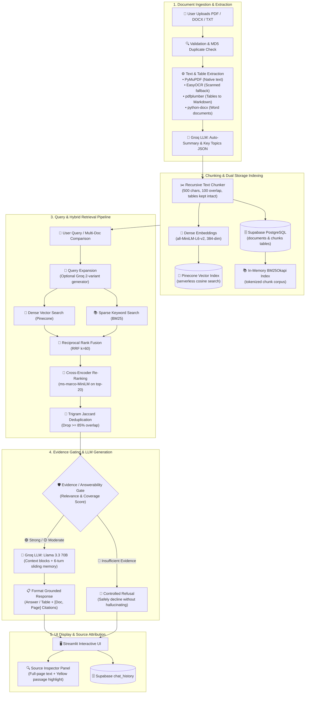

# Smart PDF/RAG Assistant

A multi-document **Retrieval-Augmented Generation (RAG)** application built in Python with Streamlit. The system ingests PDF, DOCX, and TXT files, extracts structured text and tables, performs OCR on scanned pages when necessary, and combines dense semantic search with sparse lexical search via Reciprocal Rank Fusion (RRF) and Cross-Encoder re-ranking. It provides grounded answers, verifiable page-level source citations, in-app highlighted source previews, multi-document comparison tables, and controlled refusal when evidence is insufficient.

---

## 1. Problem Understanding

When interacting with complex documents such as company policies, contracts, technical specifications, and financial reports, traditional LLMs and basic RAG setups face several practical challenges:

1. **Hallucination on Missing Facts**: Standard LLMs often invent facts or extrapolate unsupported claims when the required information is absent from the prompt context.
2. **Lack of Verifiable Grounding**: Answers generated without exact document names, page numbers, and passage previews cannot be easily verified by human reviewers.
3. **Retrieval Blind Spots**: Pure dense vector search often overlooks exact alphanumeric identifiers (e.g., policy numbers, product codes, section IDs), while pure keyword search fails to capture semantic concepts and natural language paraphrasing.
4. **Scanned Documents and Tables**: Information contained in scanned image pages or multi-column tabular layouts is frequently lost or distorted by naive plain-text parsers.
5. **Cross-Document Synthesis**: Comparing terms, conditions, or statistics across multiple files requires targeted document scoping and structured synthesis rather than generic search.

This application provides a document-grounded assistant designed to retrieve relevant evidence accurately, display transparent source references, and decline to answer when sufficient evidence cannot be found.

---

## 2. Solution Overview

The application is structured as an interactive Streamlit web interface backed by a modular Python RAG pipeline:

- **Ingestion & Processing**: Users upload one or more PDF, DOCX, or TXT documents. Files are validated, checked for duplicate MD5 hashes, parsed (with OCR and table extraction where appropriate), chunked recursively, embedded into 384-dimensional dense vectors, and stored across Pinecone (vectors) and Supabase PostgreSQL (chunks, metadata, chat history).
- **Interactive Chat**: Users query their indexed documents via a conversational interface. The assistant uses multi-turn memory to support follow-up questions.
- **Document Scoping & Comparison**: Users can query across the entire document corpus, restrict queries to a specific document using "Ask This Document", or select multiple documents for structured tabular comparisons.
- **Evidence Gating**: Every retrieval result is evaluated against a 3-tier heuristic evidence gate (🟢 Strong, 🟡 Moderate, 🔴 Insufficient). If relevance scores fall below threshold, the model returns a polite refusal rather than guessing.
- **Inspector Panel**: A dedicated sidebar panel displays AI-generated document summaries, key topic pills, and an interactive **Source Preview** that reconstructs full page text with retrieved passages highlighted in yellow.

---

## 3. Key Features

- **Multi-Format Ingestion**:
  - Native text extraction for digital PDFs via PyMuPDF (`fitz`).
  - Automatic OCR fallback via EasyOCR for scanned/image PDF pages (< 20 characters of native text).
  - Table extraction via `pdfplumber`, formatting tabular grids into clean Markdown tables.
  - DOCX parsing via `python-docx` for paragraphs and tables.
  - Plain text (`.txt`) file processing.
  - Duplicate upload detection using MD5 file hashing.
- **Advanced Hybrid Retrieval Pipeline**:
  - **Dense Vector Search**: 384-dimensional embeddings (`sentence-transformers/all-MiniLM-L6-v2`) in Pinecone Serverless.
  - **Sparse Keyword Search**: `BM25Okapi` with lowercase normalization, punctuation stripping, and tokenization.
  - **Reciprocal Rank Fusion (RRF)**: Merges dense and sparse ranked lists using standard $RRF(d) = \sum \frac{1}{k + r(d)}$ with $k=60$.
  - **Cross-Encoder Re-Ranking**: `cross-encoder/ms-marco-MiniLM-L-6-v2` joint cross-attention scoring over top-20 candidates.
  - **Query Expansion**: Optional Groq-powered query variant generation (2 variants) with multi-list RRF fusion.
  - **Near-Duplicate Chunk Filtering**: Jaccard character-trigram overlap filter (default 85% threshold) to reduce context redundancy.
- **Evidence Gating & Hallucination Mitigation**:
  - Heuristic evidence indicator based on retrieval/reranking scores:
    - 🟢 **Strong Evidence**
    - 🟡 **Moderate Evidence**
    - 🔴 **Insufficient Evidence**
  - Controlled refusal when retrieved context is inadequate or irrelevant.
- **Source Attribution & Interactive Highlighting**:
  - Page-level citations (`📄 document_name.pdf — Page N`) appended to every response.
  - In-app **Source Preview** tab reconstructing full page text with retrieved snippets highlighted in yellow (`<mark>`).
  - Retrieval diagnostics expander showing dense/sparse scores, ranks, and chunk types.
- **Document Interaction & Comparison**:
  - **"Ask This Document"**: One-click filter scoping on document summary cards.
  - **Document Comparison Mode**: Automatically formats comparative answers into structured Markdown tables across selected documents.
  - **Dynamic Query Suggestions**: Clickable starter chips generated from document summaries and key topics.
- **Conversation Memory**:
  - Sliding window memory maintaining the last 6 conversation turns (3 exchanges) in prompt context.
- **Cloud Persistence**:
  - Documents, chunk metadata, and chat history persisted in Supabase PostgreSQL.

---

## 4. Architecture

> 📖 **Full Specification**: For detailed architectural subsystem analysis and component-to-file mappings, see [`docs/architecture.md`](file:///c:/Users/heman/OneDrive/Desktop/rag%20assistant/SMART-PDF-RAG-ASSISTANT/docs/architecture.md).

```
Document Upload (PDF / DOCX / TXT)
  ↓
File Validation / MD5 Duplicate Detection
  ↓
Adaptive Extraction (PyMuPDF / EasyOCR / pdfplumber / python-docx)
  ↓
Document Summary & Key Topic Extraction (Groq LLM)
  ↓
Recursive Chunking (500 chars, 100 overlap, tables preserved)
  ↓
Dual Indexing: Dense Vectors (Pinecone) + Sparse Tokens (BM25) + Relational (Supabase)
  ↓
User Query / Comparison Request (Optional Groq Query Expansion)
  ↓
Hybrid Retrieval (Parallel Dense Cosine + Sparse BM25)
  ↓
Reciprocal Rank Fusion (RRF k=60)
  ↓
Cross-Encoder Re-Ranking (ms-marco-MiniLM-L-6-v2)
  ↓
Trigram Deduplication (Drop >= 85% overlap)
  ↓
Evidence / Answerability Gate
  ├── 🟢 Strong / 🟡 Moderate → Groq LLM (Llama 3.3 70B) → Answer + Citations
  └── 🔴 Insufficient Evidence → Controlled Refusal (No Hallucination)
  ↓
Streamlit UI Display + Source Inspector (Yellow Highlight on Full Page)
```



---

## 5. RAG Pipeline

The end-to-end data flow operates through eleven stages:

1. **Document Ingestion**: Files are uploaded through Streamlit, validated against extension allowlists (`.pdf`, `.docx`, `.txt`) and a 50MB size limit, and checked for duplicate MD5 hashes.
2. **Text & Table Extraction / OCR**:
   - Digital PDFs are parsed with PyMuPDF. If a page yields under 20 characters of text, EasyOCR renders the page as a 150 DPI image and extracts text.
   - `pdfplumber` detects and formats tabular structures as Markdown tables.
   - DOCX files are extracted via `python-docx` (paragraphs and row-major tables).
3. **Document Summarization**: Groq LLM generates an abstractive 2–3 sentence summary and 3–6 key topics formatted as JSON.
4. **Chunking**: Text is split using `RecursiveTextSplitter` (`chunk_size = 500`, `overlap = 100`). Table blocks are preserved intact as dedicated `table` chunks.
5. **Embeddings & Vector Indexing**: `all-MiniLM-L6-v2` encodes text chunks into 384-dimensional dense vectors, upserted to Pinecone with chunk metadata.
6. **Relational Storage & BM25 Indexing**: Raw chunk texts and page mappings are stored in Supabase PostgreSQL; the in-memory BM25 index is updated.
7. **Hybrid Retrieval**: Queries execute dense vector search on Pinecone and sparse keyword search on BM25 concurrently (with optional document filters).
8. **Reciprocal Rank Fusion (RRF)**: Dense and sparse ranked lists are combined using RRF scoring ($k=60$).
9. **Cross-Encoder Re-Ranking & Deduplication**: Top-20 candidates are re-scored via `ms-marco-MiniLM-L-6-v2`, and near-duplicate chunks ($\ge 85\%$ Jaccard trigram overlap) are removed.
10. **Evidence Validation (Evidence Gate)**: Top scores are evaluated. If below threshold, generation is bypassed in favor of a controlled refusal.
11. **LLM Generation & Citations**: Groq (Llama 3.3 70B) generates a grounded conversational answer or comparison table, and deduplicated source citations (`📄 doc — Page N`) are appended.

---

## 6. Retrieval Strategy

The retrieval architecture combines multiple complementary search methodologies:

### Semantic / Dense Retrieval (Pinecone + MiniLM)
- **Purpose**: Understands conceptual meaning, synonyms, and natural language paraphrasing (e.g., matching *"time off policies"* to *"annual leave entitlement"*).
- **Mechanism**: Encodes the query into a 384-dimensional dense vector and calculates cosine similarity across Pinecone vector indices.

### Sparse Lexical Retrieval (BM25)
- **Purpose**: Accurately matches exact keywords, numeric values, acronyms, and product/policy identifiers (e.g., *"INV-2024-8891"*, *"Section 4.2"*, *"HIPAA"*) that dense embeddings may compress or overlook.
- **Mechanism**: Implements `BM25Okapi` over normalized tokens with punctuation stripping.

### Reciprocal Rank Fusion (RRF)
- **Purpose**: Merges dense and sparse result lists without requiring score normalization across differing scales (cosine $[-1, 1]$ vs. unbounded BM25 scores).
- **Formula**:
  $$RRF\_Score(d) = \sum_{m \in M} \frac{1}{k + r_m(d)}$$
  where $k=60$ and $r_m(d)$ is the 1-based rank in retrieval pass $m$. Documents ranking high in both dense and sparse passes receive the highest cumulative score.

### Cross-Encoder Re-Ranking
- **Purpose**: Bi-encoders embed queries and documents independently, losing fine-grained cross-attention interactions. The Cross-Encoder (`ms-marco-MiniLM-L-6-v2`) jointly processes `(query, document)` pairs, capturing deep token-level interactions to accurately re-order the top-20 candidates before passing the top-5 to the LLM.

---

## 7. Hallucination Mitigation

The system implements a four-tiered defense against hallucinations:

1. **Evidence Gating**:
   - The `EvidenceGate` inspects top retrieval and cross-encoder scores before invoking the generation LLM.
   - If relevance scores are below minimum thresholds or if no chunks match the query, the LLM generation step is bypassed, and a standardized refusal is returned:
     > **🔴 Evidence: Insufficient**  
     > *I couldn't find enough relevant information in the uploaded documents to answer this reliably.*
2. **Strict System Prompt Constraints**:
   - System prompts explicitly direct Llama 3.3 to answer **ONLY** from the injected context blocks and state when facts are missing.
3. **Labeled Context Blocks**:
   - Each retrieved chunk is demarcated in the prompt: `[Context Block N | document_name.pdf, Page X]`, enabling the model to attribute facts directly to specific source blocks.
4. **Low Temperature & Near-Duplicate Filtering**:
   - `temperature = 0.4` reduces creative drift, while Jaccard trigram deduplication prevents repetitive chunks from crowding out relevant evidence.

---

## 8. Source Attribution

Transparency is maintained through multi-level source attribution:

- **Evidence Badge**: Every answer displays an indicator:
  - 🟢 **Evidence: Strong** (High cross-encoder/cosine score)
  - 🟡 **Evidence: Moderate** (Acceptable relevance score)
  - 🔴 **Evidence: Insufficient** (Low relevance score; refusal triggered)
- **Inline Citations**: Deduplicated list of sources appended to every answer:
  ```text
  📄 employee_handbook.pdf — Page 4
  📄 leave_policy.pdf — Page 2
  ```
- **In-App Source Preview Tab**: In the Inspector Panel, users can select any cited document and page. The application fetches the page text from Supabase and wraps the retrieved passage in `<mark style="background-color: #fef08a">` for immediate visual verification.
- **Retrieval Diagnostics**: A collapsible expander beneath each answer shows chunk IDs, retrieval scores, dense/sparse breakdown, and chunk types (`text` vs. `table`).

---

## 9. Multi-Document Reasoning

The assistant natively handles reasoning across multiple documents:

1. **Corpus-Wide Retrieval**: By default, queries retrieve evidence across all uploaded files.
2. **Targeted Scoping**: Users can select one or more specific documents via the multiselect filter or the "Ask This Document" button, applying metadata filters (`$eq` / `$in`) to both Pinecone and BM25.
3. **Structured Document Comparison**: When multiple documents are selected and a comparative question is asked (e.g., *"Compare the annual leave and probation policies in these documents"*), the system:
   - Retrieves relevant chunks across the selected files.
   - Prompts the LLM to structure the answer as a **Markdown Comparison Table**:

| Topic | Employee Handbook.pdf | Contractor Agreement.pdf |
|---|---|---|
| **Annual Leave** | 24 days paid leave (Page 4) | Not eligible for paid leave (Page 2) |
| **Probation Period** | 3 months with formal review (Page 1) | No probation period (Page 1) |
| **Notice Period** | 30 days written notice (Page 8) | 14 days written notice (Page 3) |

---

## 10. Conversation Memory

- The chat interface maintains multi-turn conversation context across interactions.
- The last **6 turns** (3 user questions and 3 assistant answers) are formatted and passed into the Groq message history.
- This allows natural follow-up queries (e.g., *"What about for part-time employees?"* or *"Can you summarize the second point?"*) without restating prior context.
- Users can reset memory at any time using the **Clear Chat History** button in the sidebar.

---

## 11. Creative Feature: Interactive Yellow Source Highlighting & In-App Page Reconstruction

The standout creative feature of this assistant is the **Interactive Source Preview with In-App Passage Highlighting**:

- **The Problem**: Standard RAG chatbots output raw text answers with plain file names, requiring users to manually open separate PDF viewers and search for cited passages.
- **The Solution**: 
  1. During ingestion, full page text layers and table grids are stored in Supabase mapped by document ID and page number.
  2. When an answer cites a document and page, the user can navigate to the **Source Preview** tab in the Inspector Panel.
  3. The system reconstructs the page text and programmatically locates the exact retrieved chunk snippet, wrapping it in an accessible HTML `<mark style="background-color: #fef08a; padding: 2px 4px; border-radius: 3px; font-weight: 500;">` element.
  4. Users can instantly verify the exact surrounding context and ensure the LLM did not quote out of context.

---

## 12. Technology Choices and Why

| Technology | Role | Why Chosen |
|---|---|---|
| **Streamlit** | UI Framework | Rapid, reactive Python web UI; built-in chat components, state management for tabs and multiselect filters. |
| **Groq (Llama 3.3 70B Versatile)** | LLM Inference | Ultra-low inference latency (>200 tokens/sec), allowing fast query expansion, JSON document summarization, and responsive RAG generation on a capable 70B open-weights model. |
| **Pinecone (Serverless)** | Vector Database | Managed cloud vector database with low-latency cosine similarity search and native metadata filtering (`$eq`, `$in`) without local infrastructure overhead. |
| **Supabase (PostgreSQL)** | Relational DB | Cloud PostgreSQL persistence for document metadata, full chunk text, and chat history with foreign-key cascade deletion. |
| **`all-MiniLM-L6-v2`** | Dense Embeddings | Lightweight (80MB), fast CPU inference, 384-dimensional dense vectors with proven retrieval performance. |
| **`rank-bm25` (BM25Okapi)** | Sparse Search | Pure Python implementation of BM25 probabilistic scoring to capture exact terms, codes, and acronyms that vector search misses. |
| **`cross-encoder/ms-marco-MiniLM-L-6-v2`** | Re-Ranker | Joint query-chunk cross-attention model that significantly refines candidate ranking over bi-encoder cosine similarity. |
| **PyMuPDF (`fitz`) + `pdfplumber`** | PDF & Table Extraction | PyMuPDF provides fast native text extraction; `pdfplumber` accurately preserves tabular structures as Markdown. |
| **EasyOCR** | OCR Fallback | Standalone PyTorch-based OCR engine that automatically activates when scanned or image-based PDF pages are detected. |
| **`python-docx`** | DOCX Parser | Reliable parsing of Microsoft Word document paragraphs and tables. |

---

## 13. Project Structure

```text
SMART-PDF-RAG-ASSISTANT/
├── app.py                          # Streamlit application entrypoint & layout
├── requirements.txt                # Python package dependencies
├── .env.example                    # Environment variable template
├── .gitignore                      # Git ignore configuration
├── README.md                       # Project documentation
│
├── components/                     # Streamlit UI modules
│   ├── chat.py                     # Chat interface, doc scope selector, suggestions
│   ├── sidebar.py                  # Settings, toggles, inspector tabs, preview
│   └── upload.py                   # File upload, validation, ingestion pipeline
│
├── services/                       # Core RAG engine modules
│   ├── parser.py                   # Document parsing dispatcher (PDF, TXT, OCR)
│   ├── docx_parser.py              # DOCX text and table extractor
│   ├── chunker.py                  # Recursive character text splitter & table chunker
│   ├── embeddings.py               # SentenceTransformer lazy-loader & batch encoder
│   ├── pinecone_store.py           # Pinecone vector upsert, query, and deletion
│   ├── bm25_retriever.py           # BM25Okapi keyword index & retrieval
│   ├── hybrid_retriever.py         # Reciprocal Rank Fusion (RRF) implementation
│   ├── reranker.py                 # Cross-Encoder joint scoring & re-ranking
│   ├── retriever.py                # Main retrieval coordinator (dense + sparse + rerank + dedup)
│   ├── evidence_gate.py            # 3-tier heuristic evidence validation & gate
│   ├── deduplicator.py             # Jaccard trigram near-duplicate chunk filter
│   ├── query_expander.py           # Groq-powered multi-query generator
│   ├── llm.py                      # Groq chat completion & citation generator
│   └── ocr.py                      # EasyOCR image text extraction singleton
│
├── database/                       # Relational database layer
│   ├── database.py                 # Supabase CRUD operations (docs, chunks, history)
│   ├── supabase_client.py          # Supabase client singleton
│   └── schema.sql                  # PostgreSQL table definitions
│
├── utils/                          # Configuration & helpers
│   ├── config.py                   # Environment variable loader & constants
│   └── helpers.py                  # Logging factory, timing decorator, formatters
│
├── data/                           # Sample test documents
│   ├── test_company.pdf            # Pre-packaged sample PDF for evaluation
│   └── .gitkeep
│
└── scratch/                        # Automated test suites
    ├── test_assessment_readiness.py # 9 end-to-end evaluation scenarios
    ├── test_reliability.py         # 30-assertion reliability & error handling suite
    ├── test_comparison.py          # Document comparison formatting & gating tests
    ├── test_docx.py                # DOCX parser & chunker integration tests
    ├── test_chunker.py             # Recursive splitter boundary & overlap tests
    ├── test_citations.py           # Citation block formatting & deduplication tests
    └── test_hybrid.py              # BM25 tokenization & RRF fusion tests
```

---

## 14. Setup

### Prerequisites
- Python 3.10 to 3.12
- Git

### Step-by-Step Installation

```bash
# 1. Clone repository
git clone https://github.com/hemanthd4641/SMART-PDF-RAG-ASSISTANT.git
cd SMART-PDF-RAG-ASSISTANT

# 2. Create and activate virtual environment
# Windows (PowerShell):
python -m venv venv
.\venv\Scripts\Activate.ps1

# macOS / Linux:
python3 -m venv venv
source venv/bin/activate

# 3. Install dependencies
pip install -r requirements.txt
```

---

## 15. Environment Variables

Copy `.env.example` to create your local `.env` file:

```bash
cp .env.example .env
```

Fill in the required configuration keys:

```env
# Groq LLM API Configuration (Get key at: https://console.groq.com)
GROQ_API_KEY=your_groq_api_key_here
GROQ_MODEL=llama-3.3-70b-versatile

# Pinecone Vector DB Configuration (Get key at: https://app.pinecone.io)
PINECONE_API_KEY=your_pinecone_api_key_here
PINECONE_INDEX_NAME=rag-assistant-index
PINECONE_ENV=us-west1-gcp-free

# Database Configuration (Supabase PostgreSQL - Get keys at: https://supabase.com)
SUPABASE_URL=https://your-project-id.supabase.co
SUPABASE_KEY=your_supabase_anon_public_key_here

# Dense Embedding Model
EMBEDDING_MODEL_NAME=all-MiniLM-L6-v2

# Application Runtime Configuration
PORT=8501
DEBUG=True
```

### Database Schema Setup (Supabase)
Open the **SQL Editor** in your Supabase dashboard, paste the contents of `database/schema.sql`, and click **Run** to provision the `documents`, `chunks`, and `chat_history` tables.

---

## 16. Running the Application

Launch the Streamlit app:

```bash
streamlit run app.py
```

Open your web browser at `http://localhost:8501`.

> **Demo Mode**: If API keys are not configured, the app launches in Demo Mode with mock responses and simulated citations, allowing full UI evaluation without credentials.

---

## 17. Testing

The repository contains automated test scripts in `scratch/`. All test suites run locally and execute real assertions:

```bash
# Run the 9 assessment evaluation scenarios
python scratch/test_assessment_readiness.py

# Run the 30-assertion reliability and error-handling suite
python scratch/test_reliability.py

# Run document comparison & citation tests
python scratch/test_comparison.py
python scratch/test_citations.py

# Run parser and chunker test suites
python scratch/test_docx.py
python scratch/test_chunker.py

# Run hybrid retrieval & RRF fusion tests
python scratch/test_hybrid.py
```

### Test Verification Status
- **`test_assessment_readiness.py`**: **9/9 PASSED** (Answerable Q&A, Unrelated Refusal, Cross-Doc Retrieval, Follow-up Memory, Document Scope Filter, MD5 Duplicate Guard, Corrupted File Errors, Source Highlighting, Comparison Grounding).
- **`test_reliability.py`**: **30/30 PASSED** (Empty file guards, whitespace validation, metadata fallback, .env isolation, secret leak checks).
- **`test_comparison.py`**: **4/4 PASSED**.
- **`test_docx.py`**: **4/4 PASSED**.

---

## 18. Sample Documents

Pre-packaged sample evaluation documents and test instructions are available in the [`sample_documents/`](file:///c:/Users/heman/OneDrive/Desktop/rag%20assistant/SMART-PDF-RAG-ASSISTANT/sample_documents/) directory:

- [`sample_documents/Employee_Handbook_2026.pdf`](file:///c:/Users/heman/OneDrive/Desktop/rag%20assistant/SMART-PDF-RAG-ASSISTANT/sample_documents/Employee_Handbook_2026.pdf) (Working hours, 3-month probation, healthcare benefits, notice period)
- [`sample_documents/Leave_Policy_2026.pdf`](file:///c:/Users/heman/OneDrive/Desktop/rag%20assistant/SMART-PDF-RAG-ASSISTANT/sample_documents/Leave_Policy_2026.pdf) (24 days annual leave, 5 days carry-forward, 10 days sick leave, 16 weeks maternity)
- [`sample_documents/Contractor_Agreement_Guidelines_2026.docx`](file:///c:/Users/heman/OneDrive/Desktop/rag%20assistant/SMART-PDF-RAG-ASSISTANT/sample_documents/Contractor_Agreement_Guidelines_2026.docx) (SOW deliverables, Net 30 payment, 14-day notice, policy matrix)

> 📖 **Evaluation & Demo Scripts**: See [`sample_documents/README.md`](file:///c:/Users/heman/OneDrive/Desktop/rag%20assistant/SMART-PDF-RAG-ASSISTANT/sample_documents/README.md) for suggested demo questions and expected behaviors, and [`docs/demo-checklist.md`](file:///c:/Users/heman/OneDrive/Desktop/rag%20assistant/SMART-PDF-RAG-ASSISTANT/docs/demo-checklist.md) for the 5–8 minute video walkthrough script.

---

## 19. Known Limitations

1. **In-Memory BM25 Index**: The BM25 keyword index is built and held in application memory from Supabase chunks. For corpora exceeding hundreds of thousands of chunks, an external search index (such as PostgreSQL `tsvector` or Elasticsearch) would be required.
2. **CPU Inference Latency**: Cross-Encoder re-ranking and EasyOCR run on CPU by default. Re-ranking adds ~200–500ms per query, and OCR on scanned pages takes several seconds per page.
3. **Heuristic Evidence Gate**: The evidence gate relies on empirical similarity and cross-encoder score thresholds rather than a formal Bayesian confidence distribution.
4. **No Multimodal Chart Understanding**: While tabular grids are extracted as Markdown tables, embedded visual diagrams and complex infographics are not parsed by the text-based extraction pipeline.

---

## 20. Future Improvements

1. **Database-Level Hybrid Search**: Implement `pgvector` and PostgreSQL `tsvector` directly in Supabase for unified database-level hybrid search.
2. **Multimodal Visual RAG**: Integrate vision models (e.g., Llama 3.2 Vision) to interpret charts, architecture diagrams, and infographics embedded within PDFs.
3. **Streaming Responses**: Stream LLM output tokens directly to the Streamlit chat UI for lower perceived latency.
4. **PDF Canvas Bounding Boxes**: Render visual bounding box rectangles directly on the PDF page canvas for cited passages.

---

## 21. AI Tools Used

In accordance with the assessment's AI-assisted development transparency requirements, the following AI tools were used during development:

### ChatGPT and Claude

Used primarily for:

* Discussing and reviewing the architecture of the multi-stage hybrid RAG pipeline, including dense retrieval, BM25, Reciprocal Rank Fusion (RRF), and cross-encoder reranking.
* Exploring implementation approaches and edge cases for document parsing, chunking, retrieval, and grounding.
* Drafting and reviewing test cases for parser edge cases, chunk boundaries, and schema-related changes.
* Developing and refining system-prompt strategies for strict document grounding and structured JSON-based summary extraction.
* Reviewing implementation decisions and identifying potential failure cases.

### Antigravity IDE

Used as an AI-assisted development environment for:

* Code completion and implementation assistance for Streamlit UI components.
* Assistance with PyMuPDF-based PDF extraction routines.
* Assistance with Supabase client integration and related application code.
* Iterative code review, debugging, and implementation support.

AI tools were used as development assistants. The final application architecture, integration, configuration, testing, debugging, and verification were reviewed and validated as part of the development process.

---

## 22. Development Time

> ⏱️ **Detailed Log**: For the complete development time distribution, see [`docs/time-spent.md`](file:///c:/Users/heman/OneDrive/Desktop/rag%20assistant/SMART-PDF-RAG-ASSISTANT/docs/time-spent.md).

| Area | Approx. Time |
|---|---:|
| Assessment analysis and existing project review | 0.5 hours |
| Document processing & ingestion (PDF/DOCX/OCR/Table extraction) | 1.5 hours |
| RAG & hybrid retrieval pipeline (Dense + BM25 + RRF + Cross-Encoder) | 2.0 hours |
| Evidence & hallucination handling (3-tier Evidence Gate & Refusals) | 1.0 hours |
| UI & creative features (Source Preview Highlighting, Comparison Table, Ask This Doc) | 1.0 hours |
| Testing & debugging (Automated test suites: 30 reliability tests, 9 assessment scenarios) | 1.0 hours |
| Documentation & architecture specification (`README.md`, `docs/architecture.md`) | 0.5 hours |
| Demo preparation (Sample document package, sample README, and demo checklist) | 0.5 hours |
| **Total** | **~8.0 hours** |
