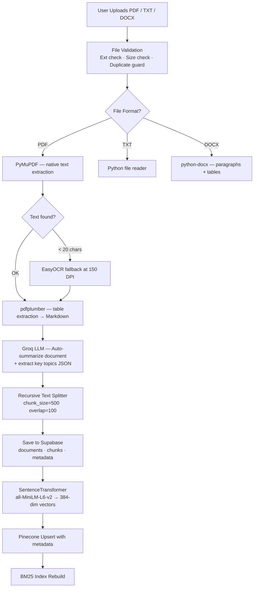
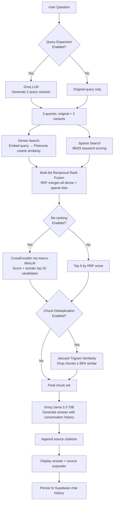

# 🧠 Document-Aware RAG Assistant

A production-grade, multi-document **Retrieval-Augmented Generation (RAG)** chatbot. Upload PDF, TXT, or DOCX files; the system automatically parses, chunks, embeds, and indexes them. You then chat with your documents conversationally — with full multi-turn memory, accurate source citations, and an advanced retrieval pipeline.

---

## 🚀 Core Technology Stack

| Layer | Technology |
|---|---|
| **UI Framework** | Streamlit |
| **LLM Inference** | Groq — Llama 3.3 70B Versatile |
| **Vector Database** | Pinecone (Serverless, Cosine, 384-dim) |
| **Cloud Database** | Supabase (PostgreSQL — metadata, chunks, chat history) |
| **Dense Embeddings** | sentence-transformers `all-MiniLM-L6-v2` |
| **PDF Parser** | PyMuPDF (`fitz`) + pdfplumber |
| **Table Extraction** | pdfplumber |
| **OCR Engine** | EasyOCR |
| **DOCX Parser** | python-docx |
| **Sparse Search** | BM25 (`rank-bm25`) |
| **Re-Ranker** | `cross-encoder/ms-marco-MiniLM-L-6-v2` |

---

## 🗂️ Directory & File Structure

```text
rag-assistant/
├── app.py                        # Streamlit app entrypoint & layout orchestration
├── requirements.txt              # Project pip dependencies
├── .env.example                  # API credentials template
├── README.md                     # This file
│
├── components/                   # Streamlit UI component renderers
│   ├── chat.py                   # Chat interface, smart doc filter, suggestion chips
│   ├── sidebar.py                # Settings, toggles, system status, stats
│   └── upload.py                 # Upload, validation, ingestion pipeline, doc management
│
├── services/                     # RAG core engine modules
│   ├── parser.py                 # PDF/TXT/DOCX dispatch + PyMuPDF + OCR fallback
│   ├── docx_parser.py            # python-docx paragraph + table extractor
│   ├── chunker.py                # Recursive character text splitter with overlap
│   ├── embeddings.py             # SentenceTransformer lazy-loader + batch encoder
│   ├── pinecone_store.py         # Pinecone SDK client, upsert, query, delete
│   ├── bm25_retriever.py         # BM25Okapi index builder + multi-doc keyword search
│   ├── hybrid_retriever.py       # Reciprocal Rank Fusion (RRF) merger
│   ├── retriever.py              # Main retrieval orchestrator (dense + sparse + rerank + dedup + expansion)
│   ├── llm.py                    # Groq chat completions + citation block generator
│   ├── ocr.py                    # EasyOCR singleton for scanned-page text extraction
│   ├── query_expander.py         # Groq-powered query variant generator
│   └── deduplicator.py           # Jaccard n-gram near-duplicate chunk filter
│
├── database/
│   ├── database.py               # Supabase CRUD: documents, chunks, chat history
│   ├── supabase_client.py        # Supabase client singleton with connection handling
│   └── schema.sql                # PostgreSQL table definitions (run once in Supabase Dashboard)
│
├── scripts/
│   ├── apply_schema.py           # Automated schema setup helper
│   ├── apply_schema_direct.py    # Direct psycopg2 schema applier (needs DB_PASSWORD)
│   └── migrate_sqlite_to_supabase.py  # One-shot SQLite → Supabase data migrator
│
├── utils/
│   ├── config.py                 # .env loader and centralized config constants
│   └── helpers.py                # Logger factory, timing decorator, file size formatter
│
├── data/
│   └── temp_uploads/             # Staging dir for uploaded files during processing
│
└── scratch/                      # Test scripts (unit/integration verification)
    ├── test_db.py
    ├── test_parser.py
    ├── test_chunker.py
    ├── test_embeddings.py
    ├── test_pinecone.py
    ├── test_retriever.py
    ├── test_llm.py
    ├── test_hybrid.py
    ├── test_ocr.py
    ├── test_tables.py
    ├── test_docx.py
    ├── test_reranker.py
    ├── test_citations.py
    ├── test_summary_stats.py
    ├── test_pipeline.py
    └── debug_chunks.py
```

---

## ⚙️ Setup & Installation

### Prerequisites
- Python 3.10 or higher
- Git

### 1. Install Dependencies

```bash
# Navigate to project directory
cd rag-assistant

# Create and activate virtual environment
python -m venv venv

# Windows (PowerShell / Command Prompt):
.\venv\Scripts\activate

# macOS / Linux:
source venv/bin/activate

# Install packages
pip install -r requirements.txt
```

### 2. Configure Environment Variables

```bash
copy .env.example .env
```

Fill in your credentials inside `.env`:

```env
GROQ_API_KEY=your_groq_api_key_here
PINECONE_API_KEY=your_pinecone_api_key_here
PINECONE_INDEX_NAME=rag-assistant-index
GROQ_MODEL=llama-3.3-70b-versatile
EMBEDDING_MODEL_NAME=all-MiniLM-L6-v2
```

> **Groq API Key** → [console.groq.com](https://console.groq.com)  
> **Pinecone API Key** → [app.pinecone.io](https://app.pinecone.io)

### 3. Pinecone Index Setup

The Pinecone index is **auto-created** on first launch if it doesn't exist. It is configured with:
- **Dimensions**: `384` (required by `all-MiniLM-L6-v2`)
- **Metric**: Cosine similarity
- **Hosting**: Serverless (AWS `us-east-1`)

To create it manually:
1. Log in to your Pinecone Console
2. Click **Create Index**
3. Name: match `PINECONE_INDEX_NAME` in `.env`
4. Dimensions: `384`, Metric: `Cosine`, Host: `Serverless`

### 4. Configure Supabase

This project uses **Supabase PostgreSQL** for persistent cloud storage.

#### 4a. Create a Supabase project
1. Go to [supabase.com](https://supabase.com) and sign in
2. Click **New Project** and name it (e.g. `rag-assistant`)
3. Choose a region, set a secure database password, click **Create project**
4. Wait ~2 minutes for provisioning

#### 4b. Apply the database schema
Once your project is ready:
1. In the Supabase dashboard → click **SQL Editor** in the left sidebar
2. Click **+ New query**
3. Copy the entire contents of `database/schema.sql` and paste it
4. Click **Run** — you should see the `documents`, `chunks`, and `chat_history` tables created

Alternatively, if you have a database password, you can run:
```bash
# Add DB_PASSWORD=your_supabase_db_password to .env first
python scripts/apply_schema_direct.py
```

#### 4c. Get your Supabase credentials
In your Supabase project dashboard → **Project Settings** → **API**:
- **Project URL** → paste as `SUPABASE_URL` in `.env`
- **anon/public key** → paste as `SUPABASE_KEY` in `.env`

### 5. Run the Application

```bash
streamlit run app.py
```

Open `http://localhost:8501` in your browser.

> **Demo Mode**: If no API keys are set, the app starts in Demo Mode — fully interactive with mock retrieval, so you can preview the layout and UI without any credentials.

---

## 📄 Document Support

| Format | Parser | Tables | OCR Fallback |
|---|---|---|---|
| **PDF** | PyMuPDF + pdfplumber | ✅ Markdown tables | ✅ EasyOCR |
| **TXT** | Python built-in | — | — |
| **DOCX** | python-docx | ✅ Row-major text | — |

**Max file size**: 50 MB per file  
**Multi-file upload**: ✅ — batch-process multiple files in one upload

---

## 🔄 Architecture & Data Flow

### Ingestion Pipeline



### Chat Retrieval Pipeline



---

## ✨ Feature Reference

### 📤 Document Ingestion

| Feature | Detail |
|---|---|
| **Multi-format support** | PDF, TXT, DOCX in a single unified pipeline |
| **Auto-processing** | Upload triggers the full parse → chunk → embed → index pipeline automatically |
| **Batch upload** | Multiple files processed in sequence per upload event |
| **Duplicate guard** | MD5 hash check prevents re-indexing the same document |
| **File validation** | Extension allowlist + 50 MB size cap with clear error messages |
| **Temp file cleanup** | Staging files deleted from disk after successful indexing |

### 🧩 Document Parsing

| Feature | Detail |
|---|---|
| **PyMuPDF** | Fast native text layer extraction from PDFs |
| **pdfplumber table extractor** | Detects tables per page, converts to clean Markdown format |
| **EasyOCR fallback** | Triggered automatically when native text < 20 chars (scanned PDFs) |
| **OCR at 150 DPI** | Page rendered as PNG pixmap → PIL Image → EasyOCR numpy array |
| **python-docx** | Paragraphs extracted in document order; table cells joined as tab-delimited rows |
| **Extraction method tracking** | Each page is tagged `native` or `ocr` for display in document stats |

### ✂️ Text Chunking

| Feature | Detail |
|---|---|
| **Recursive Character Splitter** | Splits by `\n\n` → `\n` → ` ` → character, falling back as needed |
| **Configurable chunk size** | Default 500 characters with 100-character overlap |
| **Table chunk preservation** | Table blocks kept intact (not split) to protect row/column relationships |
| **Chunk typing** | Every chunk tagged as `text` or `table` for display and analytics |
| **Unique chunk IDs** | `{doc_name}#page_{N}#text_chunk_{i}` format for traceability |

### 🧠 Embeddings & Vector Storage

| Feature | Detail |
|---|---|
| **all-MiniLM-L6-v2** | 384-dimensional dense embeddings, batch-processed at 32 items/batch |
| **Lazy model loading** | Model weights loaded into memory only on first use |
| **Pinecone Serverless** | Vectors stored with full metadata (document_name, page_number, chunk_type, text) |
| **Auto-index creation** | Pinecone index created automatically if it doesn't exist on first launch |
| **Metadata-filtered queries** | Pinecone supports `$eq` / `$in` filters for single or multi-document scoping |

### 🔍 Retrieval Pipeline

| Feature | Detail |
|---|---|
| **Dense search** | Pinecone cosine similarity using embedded query vector |
| **Sparse search (BM25)** | `BM25Okapi` index over all Supabase chunks; tokenized with punctuation removal |
| **Hybrid RRF fusion** | `RRF_score = Σ 1/(rank + k)` merges dense + sparse result lists |
| **Multi-list RRF** | When query expansion is active, all expansion-pass result lists are fused together |
| **Candidate pool scaling** | Fetches top-20 candidates when re-ranking is enabled, top-10 otherwise |

### ⚡ Query Expansion *(toggleable)*

| Feature | Detail |
|---|---|
| **Groq-powered rewriting** | Sends the user query to Llama 3.3 with a terse prompt; returns 2 alternative phrasings in JSON |
| **Parallel retrieval passes** | All 3 queries (original + 2 variants) run dense + sparse retrieval independently |
| **Multi-list RRF merge** | All retrieval results are fused via multi-list RRF for broader semantic coverage |
| **Graceful fallback** | If the LLM call fails, falls back to original query with no disruption |
| **Sidebar toggle** | Off by default; enable with "Enable Query Expansion" in sidebar |

### 🔁 Cross-Encoder Re-Ranking *(toggleable)*

| Feature | Detail |
|---|---|
| **Model** | `cross-encoder/ms-marco-MiniLM-L-6-v2` |
| **Lazy loading** | Cross-encoder weights loaded on first use, cached for the session |
| **Scoring** | Each query–chunk pair scored; results re-sorted by cross-encoder score descending |
| **Candidate pool** | Top-20 RRF candidates scored, top-5 retained |
| **Sidebar toggle** | On by default when API keys are configured |

### 🧹 Chunk Deduplication *(toggleable)*

| Feature | Detail |
|---|---|
| **Algorithm** | Jaccard similarity on character-level trigrams |
| **Threshold** | Chunks with ≥ 85% Jaccard overlap to a higher-ranked chunk are dropped |
| **Rank-preserving** | Iterates in ranked order; accepted set grows greedily |
| **Effect** | Reduces repeated passages in LLM context; improves answer conciseness |
| **Sidebar toggle** | Off by default; enable with "Enable Chunk Deduplication" in sidebar |

### 🗃️ Smart Document Filtering

| Feature | Detail |
|---|---|
| **Multiselect widget** | Appears in the chat panel; lists all currently indexed documents |
| **Multi-doc scoping** | Select one or more documents to restrict retrieval to those files only |
| **Pinecone filter** | Applies `$eq` (single doc) or `$in` (multiple docs) metadata filter to vector queries |
| **BM25 filter** | Same document list applied as a set-membership filter on the keyword index |
| **All-documents mode** | Leave multiselect empty to query across all indexed documents (default) |

### 💬 Chat Interface

| Feature | Detail |
|---|---|
| **Multi-turn conversation memory** | Last 6 turns (3 exchanges) injected into Groq prompt as real message history |
| **Conversational tone** | System prompt tuned for warmth, clarity, and natural follow-up invitations |
| **Suggestion chips** | 4 clickable starter questions displayed when chat history is empty |
| **Streaming-style display** | Answer and citations rendered in a Streamlit chat message bubble |
| **Source chunk expander** | Collapsible panel shows all retrieved chunks with scores, doc name, page, and chunk type |
| **Retrieval stats caption** | Shows dense count · BM25 count · RRF fused count · queries used (when expanded) |
| **Demo mode** | Mock response + simulated citations when API keys are absent |

### 📎 Citations

| Feature | Detail |
|---|---|
| **Automatic citation block** | Appended to every LLM answer after the main text |
| **Deduplicated sources** | Multiple chunks from the same page are listed once |
| **Format** | `📄 document_name.pdf — Page N` per unique (doc, page) pair |
| **Source Preview tab** | Reconstructs the full page text from Supabase chunks; highlights the retrieved passage in yellow |

### 🗄️ Database (Supabase PostgreSQL)

| Table | Columns |
|---|---|
| `documents` | `id` (MD5), `document_name`, `upload_timestamp`, `page_count`, `summary`, `key_topics`, `native_page_count`, `ocr_page_count` |
| `chunks` | `chunk_id`, `document_id` (FK → cascade delete), `page_number`, `chunk_text`, `chunk_type` |
| `chat_history` | `id`, `user_question`, `assistant_answer`, `timestamp` |

- **Foreign key cascade**: Deleting a document automatically removes all its chunks.
- **Auto-migration**: `init_db()` checks for and adds missing columns on startup without data loss.

### 📋 Inspector Panel

| Tab | Feature |
|---|---|
| **Document Summaries** | Select any indexed document to view: AI-generated 2–3 sentence summary, key topic pills, page count, upload timestamp, MD5 hash |
| **Source Preview** | Select a citation from the last chat turn; reconstructs the full page text; highlights the exact retrieved passage in yellow |

### 📊 Sidebar Statistics

- Documents processed count
- Total chunks (text + table breakdown)
- Active LLM model name
- Pinecone index name
- Embedding model name
- Clear Chat History button

### 🤖 LLM — Groq (Llama 3.3 70B)

| Feature | Detail |
|---|---|
| **Chat completions** | `temperature=0.4`, `max_tokens=1500` for detailed, conversational answers |
| **Document-grounded** | Context blocks injected as `[Context Block N | doc, page]` labeled sections |
| **No hallucination policy** | System prompt instructs the model to answer only from context or politely decline |
| **JSON mode** | Document summary + key topics generated with `response_format=json_object` |
| **Summary generation** | First 12,000 characters of document text → `{summary, key_topics}` JSON |
| **Graceful refusal** | If nothing relevant found, offers to clarify rather than saying "I can't" |

---

## 🎛️ Sidebar Toggle Reference

| Toggle | Default | What It Does |
|---|---|---|
| **Enable Re-ranking** | ✅ ON | Cross-encoder re-scores top-20 RRF candidates |
| **Enable Query Expansion** | ❌ OFF | Generates 2 query variants for parallel retrieval |
| **Enable Chunk Deduplication** | ❌ OFF | Drops near-duplicate chunks before LLM context build |

---

## ✅ Supported Capabilities Summary

| Capability | Status |
|---|---|
| Text PDFs | ✅ |
| Scanned / image-based PDFs | ✅ (EasyOCR) |
| PDFs with tables | ✅ (pdfplumber → Markdown) |
| TXT files | ✅ |
| DOCX files | ✅ (paragraphs + tables) |
| Multi-file upload & indexing | ✅ |
| Multi-document chat | ✅ |
| Scoped single-document chat | ✅ |
| Multi-turn conversation memory | ✅ |
| Source citations | ✅ |
| Source page preview + highlight | ✅ |
| Document summary (AI-generated) | ✅ |
| Key topic extraction | ✅ |
| Hybrid dense + sparse retrieval | ✅ |
| RRF fusion | ✅ |
| Cross-encoder re-ranking | ✅ |
| Query expansion | ✅ |
| Chunk deduplication | ✅ |
| Smart document filtering | ✅ |
| Demo mode (no API keys) | ✅ |
| Auto Pinecone index creation | ✅ |
| Supabase PostgreSQL integration | ✅ |

---

## 🔮 Future Enhancements

- OCR confidence score filtering (reject low-confidence OCR pages)
- Multi-language OCR support
- Vision-based document understanding (diagram & chart interpretation)
- Streaming LLM response output
- Chat export to PDF / Markdown
- Analytics dashboard (query history, chunk hit rates, document usage)
