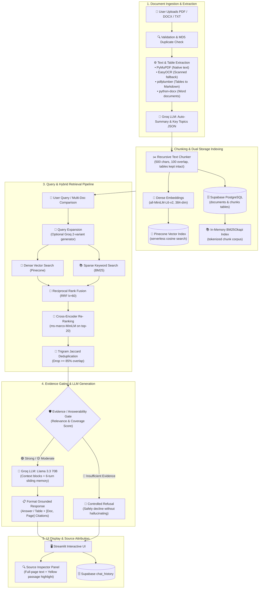

# 🏗️ System Architecture & Data Flow

This document details the architectural design, component interactions, data pipelines, and persistence models of the **Smart PDF/RAG Assistant**.

---

## 1. End-to-End System Pipeline (Ordered Flow)

```
Document Upload (PDF / DOCX / TXT)
  ↓
File Validation / MD5 Duplicate Detection
  ↓
Adaptive Extraction (PyMuPDF / EasyOCR / pdfplumber / python-docx)
  ↓
Document Summary & Key Topic Extraction (Groq LLM)
  ↓
Recursive Chunking (500 chars, 100 overlap, tables preserved)
  ↓
Dual Indexing: Dense Vectors (Pinecone) + Sparse Tokens (BM25) + Relational (Supabase)
  ↓
User Query / Comparison Request (Optional Groq Query Expansion)
  ↓
Hybrid Retrieval (Parallel Dense Cosine + Sparse BM25)
  ↓
Reciprocal Rank Fusion (RRF k=60)
  ↓
Cross-Encoder Re-Ranking (ms-marco-MiniLM-L-6-v2)
  ↓
Trigram Deduplication (Drop >= 85% overlap)
  ↓
Evidence / Answerability Gate
  ├── 🟢 Strong / 🟡 Moderate → Groq LLM (Llama 3.3 70B) → Answer + Citations
  └── 🔴 Insufficient Evidence → Controlled Refusal (No Hallucination)
  ↓
Streamlit UI Display + Source Inspector (Yellow Highlight on Full Page)
```



---

## 2. Architectural Subsystems

### Stage 1: Ingestion & Document Processing Pipeline
1. **File Validation**: Enforces extension allowlist (`.pdf`, `.docx`, `.txt`) and 50MB file size limit.
2. **MD5 Deduplication**: Hashes file content to prevent re-indexing identical files.
3. **Adaptive Text Extraction**:
   - **PyMuPDF (`fitz`)**: Fast native text layer extraction.
   - **EasyOCR Fallback**: Automatically renders scanned pages at 150 DPI when native text is under 20 characters.
   - **`pdfplumber` Table Extraction**: Isolates tabular grids and outputs clean Markdown tables.
   - **`python-docx`**: Extracts paragraphs and row-major tables from Word documents.
4. **Summary & Topic Extraction**: Groq LLM creates 2–3 sentence summaries and JSON key topics.

### Stage 2: Chunking, Indexing & Storage
- **Recursive Chunking**: `chunk_size=500` with `100` character overlap; table blocks preserved intact.
- **Dense Embedding**: `sentence-transformers/all-MiniLM-L6-v2` encodes 384-dimensional vectors.
- **Pinecone (Serverless)**: Cosine similarity vector index storing embeddings with metadata (`document_name`, `document_id`, `page_number`, `chunk_type`, `chunk_text`).
- **Supabase (PostgreSQL)**: Relational cloud database storing `documents`, `chunks`, and `chat_history`.
- **BM25 Index**: In-memory `BM25Okapi` index built from the Supabase chunks corpus.

### Stage 3: Hybrid Retrieval & Fusion
- **Dense Vector Search**: Pinecone metadata-filtered cosine search.
- **Sparse BM25 Search**: `rank-bm25` (BM25Okapi) over chunk corpus with tokenization and punctuation stripping.
- **Reciprocal Rank Fusion (RRF)**: $RRF(d) = \sum \frac{1}{k + r(d)}$ with $k=60$.
- **Cross-Encoder Re-Ranking**: `ms-marco-MiniLM-L-6-v2` joint cross-attention scoring on top-20 candidates.
- **Trigram Deduplication**: Jaccard similarity filter dropping near-duplicate chunks ($\ge 85\%$ overlap).

### Stage 4: Evidence Gating & Response Generation
- **Evidence Gate**: Heuristic 3-tier gate (🟢 Strong, 🟡 Moderate, 🔴 Insufficient).
- **Refusal Flow**: When evidence is insufficient, bypasses generation with a polite refusal.
- **Sliding Memory**: Injects last 6 conversation turns into Groq prompt.
- **Multi-Document Comparison**: Generates cross-tabulated Markdown comparison tables when comparing 2+ documents.

### Stage 5: Output, Attribution & History
- **Source Preview**: Inspector panel reconstructs full page text and highlights retrieved passages with `<mark>` tags.
- **Cloud History**: Chat exchanges persisted to Supabase `chat_history` table.

---

## 3. Component to Source File Mapping

| Diagram Component | Source File | Key Class / Function |
|---|---|---|
| **Streamlit Web UI** | [`app.py`](file:///c:/Users/heman/OneDrive/Desktop/rag%20assistant/SMART-PDF-RAG-ASSISTANT/app.py) | `main()` layout and session state orchestration |
| **Upload & Ingestion** | [`components/upload.py`](file:///c:/Users/heman/OneDrive/Desktop/rag%20assistant/SMART-PDF-RAG-ASSISTANT/components/upload.py) | `render_upload_section()`, `process_uploaded_file()` |
| **PDF/TXT Parsing & OCR** | [`services/parser.py`](file:///c:/Users/heman/OneDrive/Desktop/rag%20assistant/SMART-PDF-RAG-ASSISTANT/services/parser.py) | `parse_document()`, `parse_pdf()`, `table_to_markdown()` |
| **DOCX Parsing** | [`services/docx_parser.py`](file:///c:/Users/heman/OneDrive/Desktop/rag%20assistant/SMART-PDF-RAG-ASSISTANT/services/docx_parser.py) | `extract_docx_text()` |
| **OCR Engine** | [`services/ocr.py`](file:///c:/Users/heman/OneDrive/Desktop/rag%20assistant/SMART-PDF-RAG-ASSISTANT/services/ocr.py) | `extract_text_from_image()`, `EasyOCRService` |
| **Chunking** | [`services/chunker.py`](file:///c:/Users/heman/OneDrive/Desktop/rag%20assistant/SMART-PDF-RAG-ASSISTANT/services/chunker.py) | `DocumentChunker`, `RecursiveTextSplitter` |
| **Embeddings** | [`services/embeddings.py`](file:///c:/Users/heman/OneDrive/Desktop/rag%20assistant/SMART-PDF-RAG-ASSISTANT/services/embeddings.py) | `EmbeddingService.embed_chunks()`, `embed_query()` |
| **Pinecone Vector Store** | [`services/pinecone_store.py`](file:///c:/Users/heman/OneDrive/Desktop/rag%20assistant/SMART-PDF-RAG-ASSISTANT/services/pinecone_store.py) | `PineconeStore.upsert_chunks()`, `query_similar_chunks()` |
| **BM25 Keyword Search** | [`services/bm25_retriever.py`](file:///c:/Users/heman/OneDrive/Desktop/rag%20assistant/SMART-PDF-RAG-ASSISTANT/services/bm25_retriever.py) | `BM25Retriever.retrieve_bm25()`, `build_index()` |
| **RRF Fusion** | [`services/hybrid_retriever.py`](file:///c:/Users/heman/OneDrive/Desktop/rag%20assistant/SMART-PDF-RAG-ASSISTANT/services/hybrid_retriever.py) | `reciprocal_rank_fusion()` |
| **Cross-Encoder Re-Ranking** | [`services/reranker.py`](file:///c:/Users/heman/OneDrive/Desktop/rag%20assistant/SMART-PDF-RAG-ASSISTANT/services/reranker.py) | `RerankerService.rerank()` |
| **Query Expansion** | [`services/query_expander.py`](file:///c:/Users/heman/OneDrive/Desktop/rag%20assistant/SMART-PDF-RAG-ASSISTANT/services/query_expander.py) | `QueryExpander.expand_query()` |
| **Chunk Deduplication** | [`services/deduplicator.py`](file:///c:/Users/heman/OneDrive/Desktop/rag%20assistant/SMART-PDF-RAG-ASSISTANT/services/deduplicator.py) | `deduplicate_chunks()`, `jaccard_similarity()` |
| **Evidence Gate** | [`services/evidence_gate.py`](file:///c:/Users/heman/OneDrive/Desktop/rag%20assistant/SMART-PDF-RAG-ASSISTANT/services/evidence_gate.py) | `EvidenceGate.evaluate()` |
| **LLM Generation & Citations** | [`services/llm.py`](file:///c:/Users/heman/OneDrive/Desktop/rag%20assistant/SMART-PDF-RAG-ASSISTANT/services/llm.py) | `LLMService.generate_response()`, `generate_citations_block()` |
| **Database Persistence** | [`database/database.py`](file:///c:/Users/heman/OneDrive/Desktop/rag%20assistant/SMART-PDF-RAG-ASSISTANT/database/database.py) | `save_document()`, `save_chunks()`, `save_chat_turn()` |
| **Inspector & Source Preview** | [`components/sidebar.py`](file:///c:/Users/heman/OneDrive/Desktop/rag%20assistant/SMART-PDF-RAG-ASSISTANT/components/sidebar.py) | `render_inspector_panel()`, `render_source_preview_tab()` |
